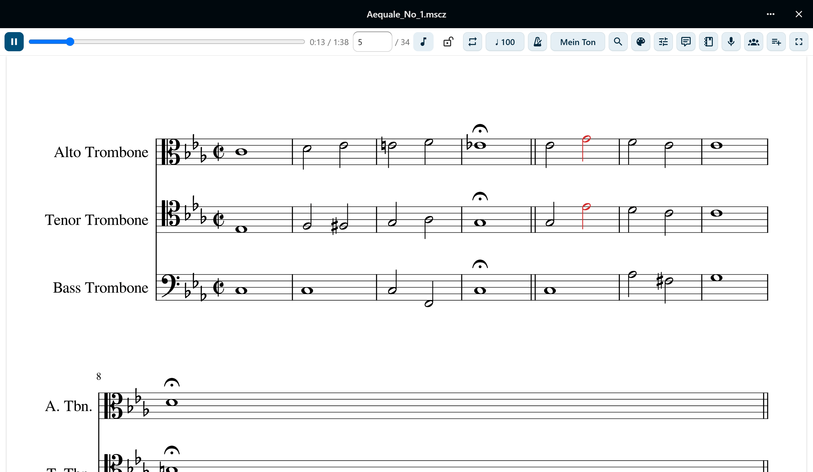
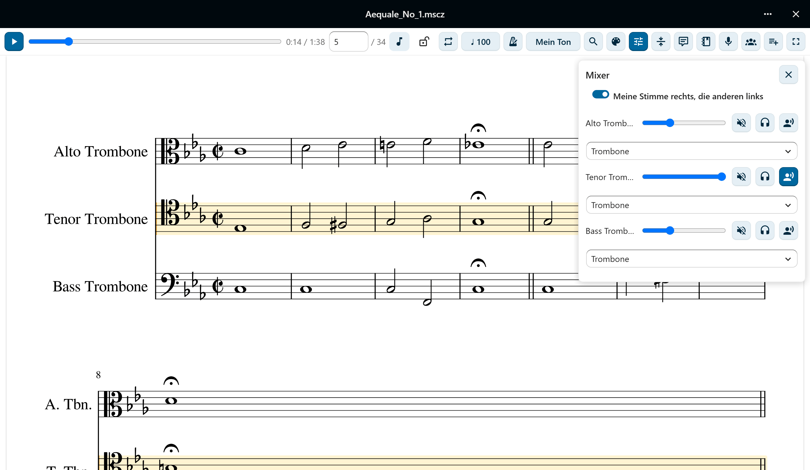
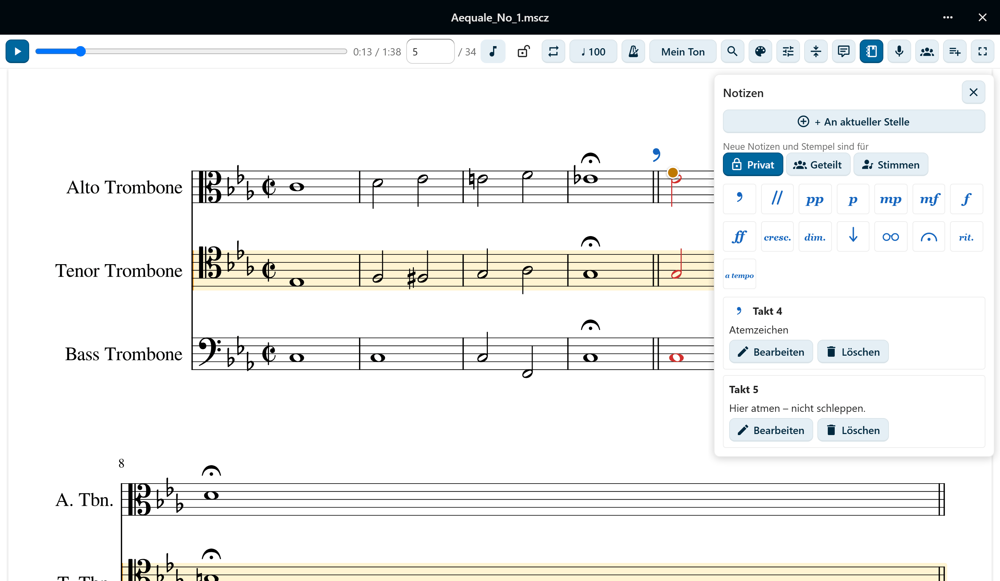
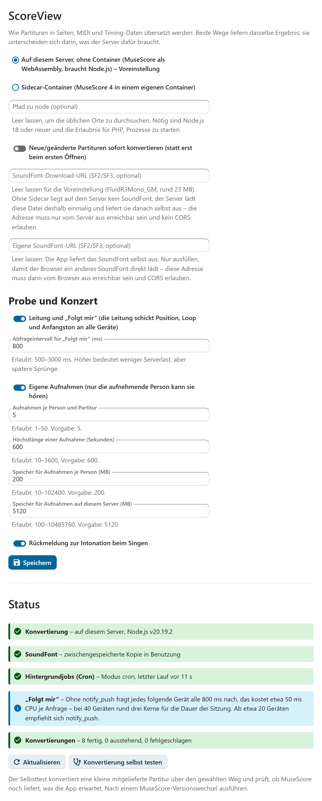

# ScoreView

[](https://github.com/AndiMb/scoreview/actions/workflows/ci.yml)
[](LICENSE)

Nextcloud-App, die MuseScore-Partituren direkt aus Files anzeigt und im Browser
abspielt – als originalgetreue MuseScore-Notation mit einem Wiedergabe-Cursor,
der synchron mitläuft, statt als starrer PDF-Export.

Gedacht für Chor- und Ensemblearbeit: Die Noten sehen aus wie die eigenen Noten,
jede Stimme ist einzeln hörbar, und jeder Takt ist in einem Klick erreichbar.



## Was die App kann

**Noten lesen.** MuseScores eigenes Seitenbild als Vektorgrafik – Zoom ohne
Qualitätsverlust, Zoom-Presets, Vollbild, und ein Autoscroll, das den laufenden
Takt im Sichtband hält. Wie die klingende Stelle markiert wird, entscheidet
jede Nutzerin selbst: eingefärbte Notenköpfe oder ein Band, in einer frei
wählbaren Farbe.

**Hören, was man üben will.** Die Wiedergabe wird im Browser synthetisiert, nicht
als fertiges MP3 abgespielt. Deshalb lässt sich pro Stimme die Lautstärke regeln,
stummschalten und solo hören, das Tempo in BPM ändern und ein Metronom
zuschalten – auf jedem Schlag oder nur auf dem Taktanfang. „Meine Stimme" hebt
eine Stimme hervor und lässt die übrigen leise mithörbar.



**Gezielt proben.** Taktnavigation mit dauerhaft sichtbarer Taktangabe, ein Loop
über einen frei gewählten Taktbereich mit Markierung im Notenbild, und ein Klick
auf eine Note springt genau dorthin.

**Notizen machen.** Privat oder mit allen geteilt, die die Datei sehen. Sie
hängen an einer musikalischen Position statt an Pixeln und überstehen deshalb
ein Neurendern und einen Re-Upload derselben Partitur.



**Auf dem Tablet am Notenständer.** Touch-Bedienung, Pinch-Zoom und ein
Bildschirm, der während der Wiedergabe nicht schlafen geht. Im
**Aufführungsmodus** wirken nur noch Blättern und Zoom – ein versehentlicher
Tipp löst nichts aus –, und `Bild↓`/`Bild↑` oder ein Bluetooth-Pedal blättern so
weiter, dass keine Zeile verloren geht. Auf Wunsch helle Noten auf dunklem
Grund, eingebettete Bilder bleiben dabei unverändert.

**Üben.** Der **Anfangston** spielt, solange man den Knopf hält, den Ton der
eigenen Stimme an der aktuellen Stelle oder den Grundton der Tonart. „Meine
Stimme“ merkt sich die App je Partitur und legt sie auf Wunsch rechts ins
Stereobild, die übrigen links. Der **Speed-Trainer** steigert das Tempo mit
jedem Loop-Durchlauf bis zum Zieltempo.

**In der Chorprobe.** Wer eine Partitur besitzt, kann **Leitungen** ernennen.
Sie setzen **Stimmnotizen** und **Stempel** (Atemzeichen, Zäsur, Dynamik …),
die jede Stimme hervorgehoben und die übrigen zurückgenommen sieht. Die
Taktnavigation versteht **Studierbuchstaben**: „C“ und „C+3“ springen dorthin.
Mit **„Folgt mir“** schickt die Leitung Stelle, Loop und Anfangston an alle
Geräte im Raum – wer selbst navigiert, löst sich und kommt mit einem Tipp
zurück.

**Im Konzert.** Eine **Setliste** ist eine Datei `*.setlist.md` in Files, eine
Liste von Links auf Partituren, im Texteditor oder in ScoreView bearbeitbar.
Im Viewer geht es von Stück zu Stück, ohne dass Aufführungsmodus, Zoom oder
SoundFont neu geladen werden.

**Sich selbst hören.** **Eigene Aufnahmen**, synchron zu Cursor und Begleitung
abspielbar, hört nur, wer sie gemacht hat. Die **Rückmeldung zur Intonation**
zeigt beim Singen eine Nadel am Cursor und danach die Stellen, die zu hoch oder
zu tief waren. Das Mikrofon läuft nur auf ausdrücklichen Wunsch, ein roter Punkt
zeigt wofür.

Alles davon geht auch in den mobilen Nextcloud-Apps – bis auf das Mikrofon in
der Android-App, dort über „Im Browser öffnen“. Die Verwaltung kann „Folgt mir“,
Aufnahme und Intonation einzeln abschalten; was die Funktionen kosten und wo sie
enden, steht in [docs/limits.md](docs/limits.md#probe--und-konzertfunktionen).

Tastatur im Viewer: `Leertaste` Start/Stopp · `←` `→` Takt zurück/vor · `L` Loop
· `+` `−` Zoom · `0` Seitenbreite · `Bild↓` `Bild↑` blättern.

Oberfläche auf Deutsch und Englisch.

## Wie es funktioniert

Eine hochgeladene `.mscz`-Datei wird **einmalig** serverseitig zu Notenseiten
(SVG), MIDI und Timing-Daten konvertiert und das Ergebnis gecacht. Erneutes
Öffnen rendert nicht neu; eine neue Konvertierung stößt eine Änderung an der
Datei an – oder der Knopf „Neu konvertieren" im Viewer, wenn eine neuere Fassung
der App dieselbe Partitur besser setzt. Daneben steht, über welchen der beiden
Wege unten die angezeigten Seiten gesetzt wurden. Die Audiowiedergabe passiert
clientseitig im Browser, mit einem SoundFont, das die App selbst ausliefert.

Für die Konvertierung gibt es **zwei gleichwertige Wege**, die dasselbe
Ergebnis liefern und sich nur darin unterscheiden, was der Server dafür braucht:

| | **Lokal** (Voreinstellung) | **Sidecar** |
|---|---|---|
| Braucht | Node.js ≥ 18 auf dem Nextcloud-Server | einen Docker-Host |
| MuseScore | MuseScore 4.7.5 als WebAssembly, im App-Paket | echtes MuseScore 4 im Container |
| Einzurichten | nichts | Container starten, Adresse und Secret eintragen |
| Empfohlen, wenn | keine Container laufen | ohnehin welche laufen |

Der lokale Weg ist voreingestellt, weil er der einzige ist, der nach
`app:enable` schon fertig ist. Ausführlich in
[docs/architecture.md](docs/architecture.md).

Kann der Server **keinen von beiden** ausführen – verwaltetes Hosting ohne
Node-Laufzeit und ohne Container –, konvertiert der Browser der Nutzerin:
dieselbe Engine, dasselbe Ergebnis, aber ohne Cache und mit rund 14 MB
einmaligem Download je Gerät
([E7](docs/architecture.md#e7-konvertierung-im-browser-als-rückfall)). Dieser
Rückfall ist nirgends wählbar und greift nur, wo sonst gar nichts liefe.

## Voraussetzungen

- Nextcloud 31–35, PHP 8.1–8.5
- Einer der beiden Konvertierungswege oben – oder keiner: Wo verwaltetes
  Hosting weder Container noch eine Node-Laufzeit erlaubt, springt der Rückfall
  im Browser ein
  ([E7](docs/architecture.md#e7-konvertierung-im-browser-als-rückfall)). Warum
  serverseitiges Rendern dort nicht geht, steht unter
  [E3](docs/architecture.md#e3-zwei-konvertierungswege-hinter-einer-api).

## Installation

```sh
occ app:enable scoreview
```

Mehr ist für die Konvertierung nicht nötig: Voreingestellt ist der lokale Weg,
und was er braucht, liegt im App-Paket. Das SoundFont holt der Server beim
ersten Abspielen selbst (~23 MB, FluidR3Mono_GM) – auch dafür ist nichts
einzutragen.

Wer stattdessen den Sidecar fahren will, startet ihn zusätzlich und wählt ihn
unter **Einstellungen → Verwaltung → ScoreView** aus:

```sh
docker build -t scoreview-musescore-cli sidecar/
docker network create scoreview-net
docker network connect scoreview-net <nextcloud-container>
docker run -d --name scoreview-sidecar --network scoreview-net \
  -e SCOREVIEW_SIDECAR_SECRET="$(openssl rand -hex 32)" \
  --memory=2g --pids-limit=512 scoreview-musescore-cli
```



So oder so fehlt noch ein einmaliger Schritt: Background-Jobs im Modus `cron`.
Die Mimetype-Registrierung für `.mscz` ist empfohlen, aber nicht nötig – ohne
sie öffnet die Dateiaktion „In ScoreView öffnen" die Partitur:
**[vollständige Anleitung](docs/installation.md)**.

## Dokumentation

| Dokument | Inhalt |
|---|---|
| [Installation und Konfiguration](docs/installation.md) | Einrichtung Schritt für Schritt, Einstellungen, Aktualisieren |
| [Architektur](docs/architecture.md) | Aufbau, Entwurfsentscheidungen, Datenfluss, Formatgrundlagen |
| [Grenzwerte und Einschränkungen](docs/limits.md) | Gemessene Werte, bekannte Lücken, was die App bewusst nicht tut |
| [Troubleshooting](docs/troubleshooting.md) | Fehlerbilder und was hilft |
| [Entwicklung](docs/development.md) | Bauen, testen, Konventionen, Release |
| [Sidecar](sidecar/README.md) | Betrieb und HTTP-API des Konvertierungsdienstes |

Was sich von Fassung zu Fassung geändert hat, steht im
[Changelog](CHANGELOG.md).

## Mitarbeiten

Siehe [CONTRIBUTING.md](CONTRIBUTING.md). Fehler und Wünsche gehören in die
[Issues](https://github.com/AndiMb/scoreview/issues).

## Lizenz und Herkunft

ScoreView steht unter AGPL-3.0-or-later, siehe [LICENSE](LICENSE).

- Die Notensatz- und Konvertierungsarbeit macht **MuseScore Studio** (GPL-3.0) –
  im Sidecar als gepinntes AppImage, auf dem lokalen Weg über die
  [scoreview-engine](https://github.com/AndiMb/scoreview-engine), MuseScores
  Notensatz Qt-frei nach WebAssembly übersetzt.
- Das **SoundFont** für die Wiedergabe stammt aus der MuseScore-Installation
  (MuseScore General von S. Christian Collins, MIT) beziehungsweise aus der
  Quelle, die der Betreiber hinterlegt.
- Die Partitur auf den Bildern ist Anton Bruckners *Aequale Nr. 1* in der
  [OpenScore-Ausgabe](https://musescore.com/openscore/scores/4074271) (CC0).
